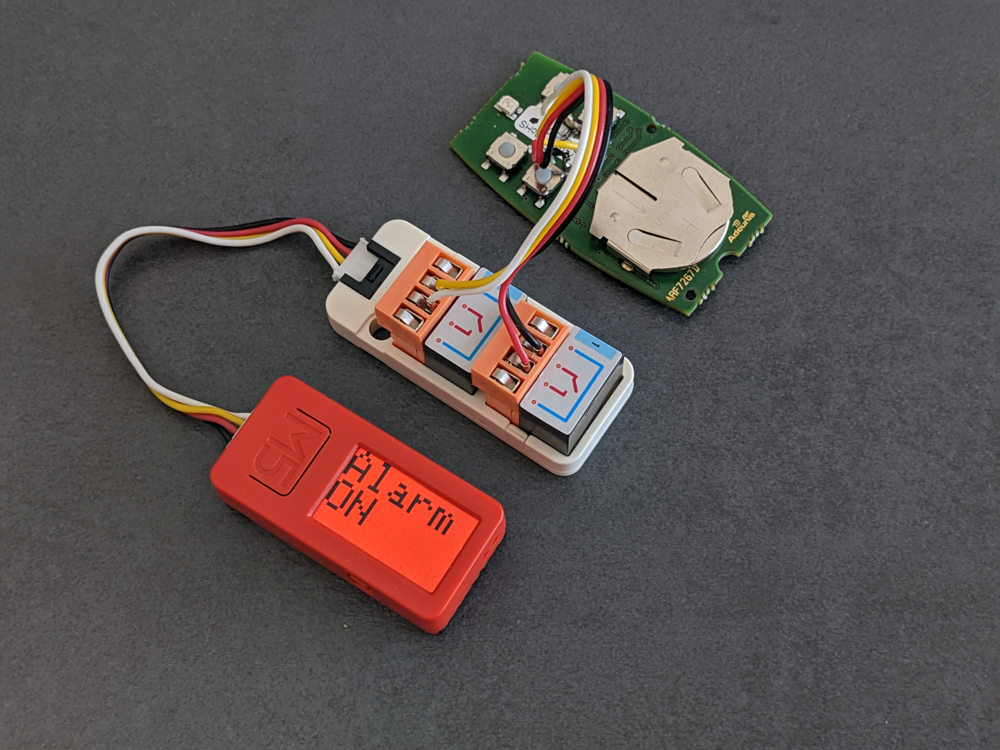

# esp-alarm-assistant
**esp-alarm-assistant** is a solution for making an alarm controllable in Home Assistant by using relays to press remote control buttons, and a microphone to determine whether the siren is ringing.

This project was designed for an [M5StickC Plus](https://shop.m5stack.com/products/m5stickc-plus-esp32-pico-mini-iot-development-kit), and has been tested with a [Somfy Protexiom](https://boutique.somfy.fr/alarme-securite/somfy-protect/alarmes-sans-fil.html) alarm and [this remote control](https://boutique.somfy.fr/telecommande-alarme-on-off-groupes.html).

## Features
- Arm and disarm your alarm remotely or via automations thanks to Home Assistant (via geolocation for example)
- Get notifications if your alarm's siren is ringing (if the minimum sound level measured during a certain amount of time is above a certain threshold)
- Cause your alarm's siren to ring if your alarm supports it ("panic mode"), for example if your [Frigate](https://frigate.video/) instance has detected a person.
- ... get metrics and act on the ambiant sound level, for rudimentary presence detection?

## Preview


# Prerequisites

## Hardware
- An alarm with a siren and an on/off remote control
- An [M5StickC Plus](https://shop.m5stack.com/products/m5stickc-plus-esp32-pico-mini-iot-development-kit) or other ESP32. You can get one [here](https://www.digikey.fr/fr/products/detail/m5stack-technology-co-ltd/K016-H/15771301?utm_medium=email&utm_source=oce&utm_campaign=3314_OCE22RT&utm_content=productdetail_FR&utm_cid=2455007&so=77654399&mkt_tok=MDI4LVNYSy01MDcAAAGGssdqOVJqwROm0PU1SuWvYCzapjFBFw1Lb8uv0_POoFERIHCwqu1031kKeph3oC28WtCSvfbDsEaWA2LanEIs7nHUU1Lz_iwg8LU2JH1x) in France for example. If you get another ESP32, you will need an external microphone and likely make changes to the source code.
- A pair of relays, or optocouplers, or other means to trigger the alarm remote control buttons. I used [this kit](https://shop.m5stack.com/products/2-channel-spst-relay-unit) for minimal soldering

## Software
- [The Arduino IDE](https://www.arduino.cc/en/software). Follow [these instructions](https://docs.m5stack.com/en/arduino/arduino_development) for setting up the Aruino IDE for use with the M5StickC Plus.
- Home Assistant
- An MQTT Broker, such as the "Mosquitto broker" add-on for Home Assistant

# Getting started

## Hardware
- On your alarm's remote control buttons, identify which button pins you need to short in order to trigger the arming and disarming. On [this Somfy remote control](https://boutique.somfy.fr/telecommande-alarme-on-off-groupes.html), the two connectors on one side of each button can be used (e.g. the two left pins of each button, or the two right pins of each button)
- Solder leads to those pins on one side, and connect them to the relays on the other side.
- Once the code has been uploaded and tested on the M5StickC PLUS, install the assembly close to the alarm siren, but in a place where it can't be seen and found easily.

## Software
- Edit [esp-alarm-assistant.ino](src/esp-alarm-assistant.ino) in order to configure your M5StickC Plus:

``` c
// Configuration
const char* ssid            = "Wi-Fi SSID";                                 // Wi-Fi SSID
const char* password        = "Wi-Fi password";                             // Wi-Fi password
const char* mqtt_server     = "MQTT broker IP address";                     // MQTT broker IP address
const uint16_t mqtt_port    = 12345;                                        // MQTT broker port
const char* mqtt_login      = "MQTT broker username";                       // MQTT broker username
const char* mqtt_password   = "MQTT broker password";                       // MQTT broker password
const char* mqtt_topic      = "MQTT topic for controlling the alarm";       // MQTT topic for controlling the alarm
const char* mqtt_topic_db   = "MQTT topic for reporting noise level";       // MQTT topic for reporting noise level
const char* arm_message     = "MQTT payload for arming the alarm";          // MQTT payload for arming the alarm
const char* disarm_message  = "MQTT payload for disarming the alarm";       // MQTT payload for disarming the alarm
const char* sos_message     = "MQTT payload for sounding the alarm";        // MQTT payload for sounding the alarm
const uint16_t sos_duration = 16000;                                        // Milliseconds on the "ON" button for sounding the alarm
const uint16_t send_every   = 5000;                                         // Milliseconds between sound level reports
const uint16_t time_between_samples = 100;                                  // Milliseconds between each sound measurement
```
- Once the code is uploaded on the M5StickC Plus, you should:
  - See it on your network
  - Start seeing MQTT messages coming in with sound level reports. If you're using the Home Assistant "Mosquitto broker" add-on, go to Settings --> Devices & Services --> On the "Mosquitto broker" add-on card, click on "CONFIGURE" --> In the "Listen to a topic" card, enter what you entered for "MQTT topic for reporting noise level" and click on "START LISTENING". You should see these kinds of messages come in at the frequency you set for `send_every`
  
 ``` json
 {
    "min": 33.1,
    "avg": 37.92,
    "max": 48.85,
    "N": 50
}
```

# Acknowledgements
- The whole sound level detection part was taken from [this awesome project](https://qiita.com/tomoto335/items/263b23d9ba156de12857) by [@tomoto335](https://twitter.com/tomoto335). The original source code is available [here](https://gist.githubusercontent.com/tomoto/6a1b67d9e963f9932a43c984171d80fb/raw/4c27b16745debfc93d39006bb03307d3958a3b28/LoudnessMeter.ino).
- The [M5StickC Plus documentation](https://github.com/m5stack/M5StickC-Plus)

# License
**esp-alarm-assistant** is licensed under the [MIT License](LICENSE)
